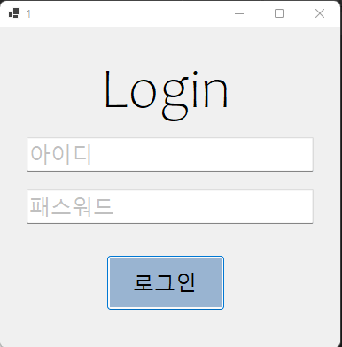
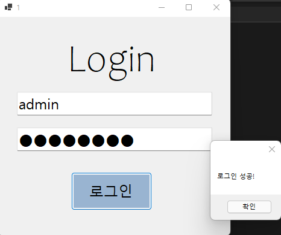
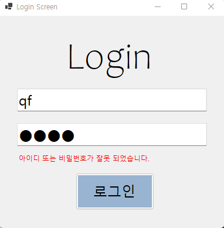

# (C# 코딩) 로그인 스크린

## 개요
- C# 프로그래밍 학습
- 1줄 소개:
	- 사용자의 아이디와 패스워드를 입력받는 로그인 화면
- 사용한 플랫폼:
	- C#, .NET Windows Forms, Visual Studio, GitHub
- 사용한 컨트롤:
	- Label, TextBox, Button
- 사용한 기술과 구현한 기능:
	- Visual Studio를 이용해 UI 디자인
	- 패스워드 입력 내용을 숨기는 기능 구현
	- Placeholder 기능 구현
	- 탭을 이용한 입력포커스 제어

## 실행 화면 (과제1)
- 과제1 코드의 실행 스크린샷

- 과제 내용
	- WinForms의 기본 컨트롤인 TextBox, Button, Label을 활용하여 로그인 화면 UI를 구성하였습니다.
	- 사용자 편의를 위한 Placeholder 기능과 보안을 위한 비밀번호 마스킹 기능을 구현하였습니다.
	- 논리 연산자를 이용해 아이디와 비밀번호의 일치 여부를 판단하고, 결과에 따라 사용자에게 알림을 주는 로직을 작성하였습니다.

- 구현 내용과 기능 설명
	- TextBox를 사용하여 사용자 정보를 입력받고, 비밀번호 입력창에는 PasswordChar 속성을 설정하여 입력된 문자가 외부로 노출되지 않도록 보안 처리를 하였습니다.
	- 사용자가 입력 전 입력창의 목적을 인지할 수 있도록 Placeholder 텍스트를 구성하고, 입력 여부에 따라 가이드 문구가 동적으로 제어되도록 구현하였습니다.
	- 로그인 버튼 클릭 시 && 연산자를 사용하여 아이디와 패스워드가 미리 정의된 데이터와 모두 일치하는지 검증하는 조건문 로직을 구현하였습니다.
	- 인증 결과에 따라 MessageBox를 호출하여 사용자에게 로그인 성공 또는 실패 상황을 명확하게 전달하도록 처리하였습니다.

## 실행 화면 (과제2)
- 과제2 코드의 실행 스크린샷

- 과제 내용
	- 기존의 팝업형 메시지 박스 대신, 로그인 화면 내에 에러 메시지를 직접 표시하여 사용자 흐름을 유지하는 UI를 구성하였습니다.
	- 아이디 또는 비밀번호가 틀렸을 경우, 입력창 하단에 경고 문구를 동적으로 보여주는 기능을 구현하였습니다.
	- 에러 메시지의 노출 여부를 제어하여 불필요한 정보가 화면에 항상 머물지 않도록 UX를 개선하였습니다.

- 구현 내용과 기능 설명
	- 에러 메시지용 Label 컨트롤을 미리 배치하고, 초기 상태를 Visible = false로 설정하여 평소에는 화면에 보이지 않도록 처리하였습니다.
	- 인증 실패 시 논리 연산 결과에 따라 Visible 속성을 true로 변경하여 사용자에게 즉각적인 시각적 피드백을 제공하도록 구현하였습니다.
	- 에러 메시지를 붉은색 글씨로 강조하고 입력창과 버튼 사이에 배치하여, 사용자가 어디서 오류가 발생했는지 시선 이동을 최소화하며 확인할 수 있도록 설계하였습니다.
	- 로그인 시도 시마다 상태를 체크하여, 조건이 충족되지 않을 때만 메시지가 나타나도록 로직을 구성하였습니다.